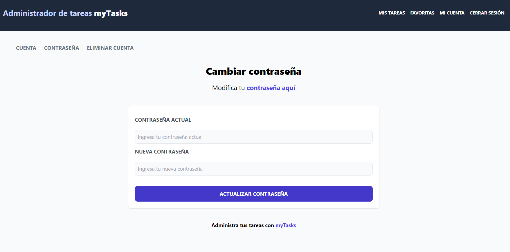
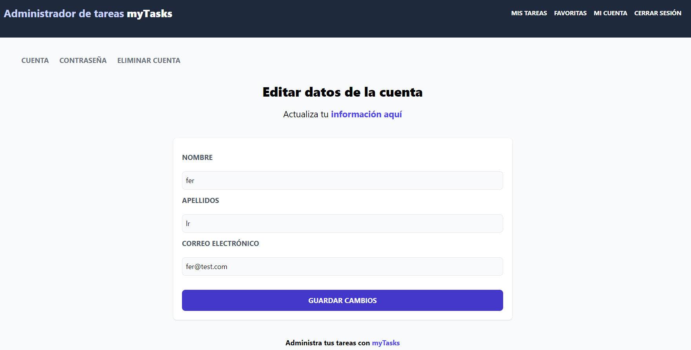
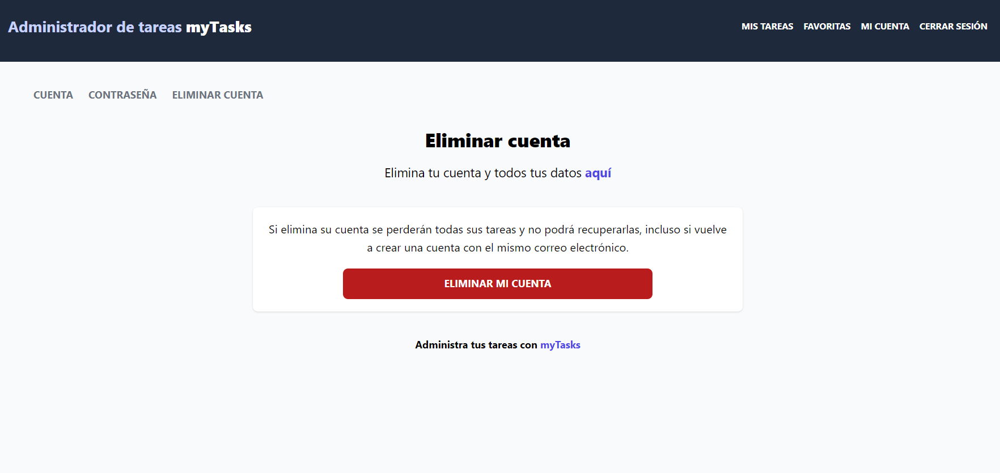

# MyTasks: frontend
Frontend of a to-do list web app built with the MERN stack.

## Features
* User registration
* Password reset
* Create, edit, and delete tasks
* Add and remove tasks from favorites
  
## Installation
1. Clone the repository
```bash
git clone https://github.com/Fernando-LRz/mytasks-frontend.git
``` 
2. Navigate to the project directory
```bash
cd mytasks-frontend
```
3. Install dependencies
```bash
npm install
```

## Run
```bash
npm run dev
```

## Images
| Tasks                                                            |
| ---------------------------------------------------------------- |
|            |

| Favorite tasks                                                   |
| ---------------------------------------------------------------- |
|   |

| Change password                                                  |
| ---------------------------------------------------------------- |
|  |

| Update account info                                              |
| ---------------------------------------------------------------- |
|   |

| Delete account                                                   |
| ---------------------------------------------------------------- |
|   |
